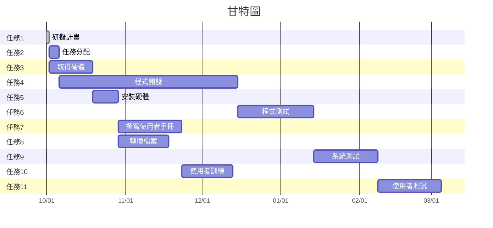
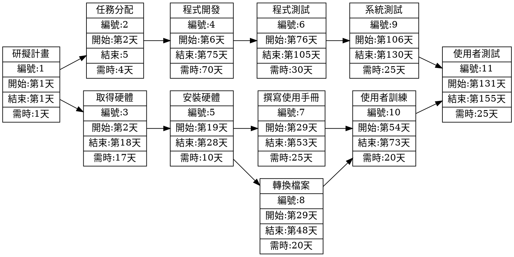
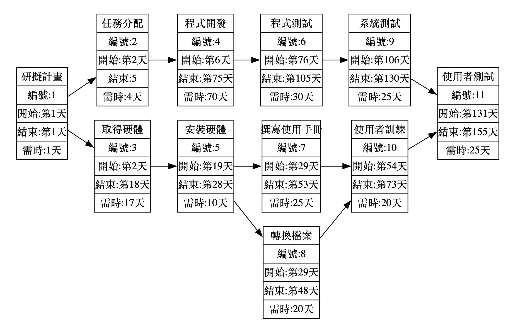

# hw2

```mermaid
gantt
    title 甘特圖
    dateFormat  YYYY-MM-DD
    axisFormat  %m/%d

    section 任務1
    研擬計畫: done,  t1, 2024-10-01, 1d
    section 任務2
    任務分配: t2, after t1, 4d
    section 任務3
    取得硬體: t3, after t1, 17d
    section 任務4
    程式開發: t4, after t2, 70d
    section 任務5
    安裝硬體: t5, after t3, 10d
    section 任務6
    程式測試: t6, after t4, 30d
    section 任務7
    撰寫使用者手冊: t7, after t5, 25d
    section 任務8
    轉換檔案: t8, after t5, 20d
    section 任務9
    系統測試: t9, after t6, 25d
    section 任務10
    使用者訓練: t10, after t7, 20d
    section 任務11
    使用者測試: t11, after t9, 25d
```

```graphviz
digraph {
	node[shape=record];
	rankdir="LR";
    no1 [label = "研擬計畫 | 編號:1 | 開始:第1天 | 結束:第1天 | 需時:1天"]
    no2 [label = "任務分配 | 編號:2 | 開始:第2天 | 結束:5 | 需時:4天"]
    no3 [label = "取得硬體 | 編號:3 | 開始:第2天 | 結束:第18天 | 需時:17天"]
    no1->no2
    no1->no3
    no4 [label = "程式開發 | 編號:4 | 開始:第6天 | 結束:第75天 | 需時:70天"]
    no2->no4
    no5 [label = "安裝硬體 | 編號:5 | 開始:第19天 | 結束:第28天 | 需時:10天"]
    no3->no5
    no6 [label = "程式測試 | 編號:6 | 開始:第76天 | 結束:第105天 | 需時:30天"]
    no4->no6
    no7 [label = "撰寫使用手冊 | 編號:7 | 開始:第29天 | 結束:第53天 | 需時:25天"]
    no5->no7
    no8 [label = "轉換檔案 | 編號:8 | 開始:第29天 | 結束:第48天 | 需時:20天"]
    no5->no8
    no9 [label = "系統測試 | 編號:9 | 開始:第106天 | 結束:第130天 | 需時:25天"]
    no6->no9
    no10 [label = "使用者訓練 | 編號:10 | 開始:第54天 | 結束:第73天 | 需時:20天"]
    no7->no10
    no8->no10
    no11 [label = "使用者測試 | 編號:11 | 開始:第131天 | 結束:第155天 | 需時:25天"]
    no9->no11
    no10->no11
}
```

