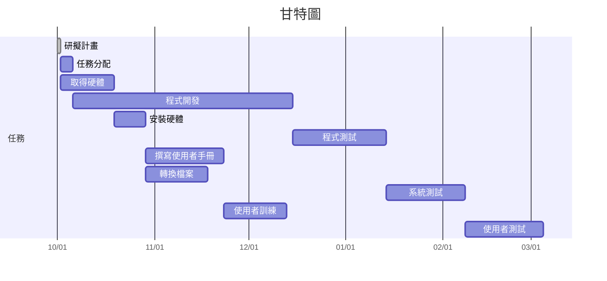

# hw2

```mermaid
gantt
    title 甘特圖
    dateFormat  YYYY-MM-DD
    axisFormat  %m/%d

    section 任務
    研擬計畫: done,  t1, 2024-10-01, 1d
    任務分配: t2, after t1, 4d
    取得硬體: t3, after t1, 17d
    程式開發: t4, after t2, 70d
    安裝硬體: t5, after t3, 10d
    程式測試: t6, after t4, 30d
    撰寫使用者手冊: t7, after t5, 25d
    轉換檔案: t8, after t5, 20d
    系統測試: t9, after t6, 25d
    使用者訓練: t10, after t7, 20d
    使用者測試: t11, after t9, 25d
```

